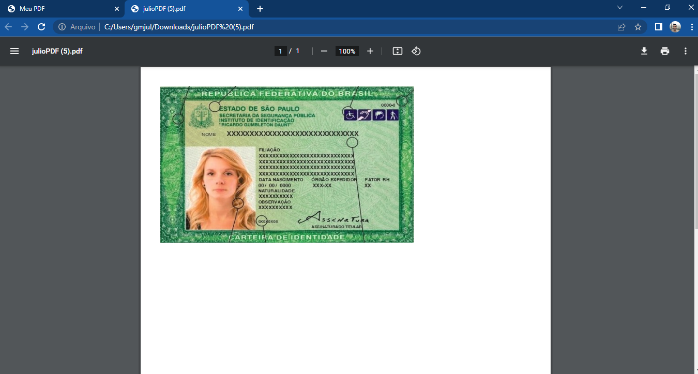

# GeradorDePDF
Gerador de PDF com JavaScript

## Sobre o projeto
Um geredor de JPEG para PDF simples usando o jsPDF que é um projeto open source disponível no GitHub por meio da licença MIT.

## Tecnologias utilizadas
**HTML, CSS e JavaScript**

## Autor
-[Julio Reis](https://github.com/julio-r-ai)

## Fotos do projeto

#### Carregando foto para conversão

#### PDF gerado...!

